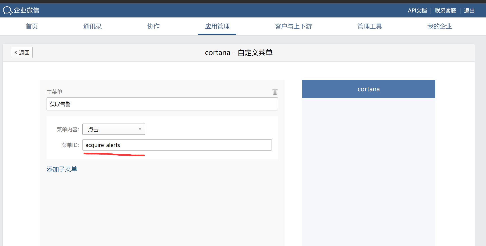

# alertmanager-webhook
alertmanager-webhook接收alertmanager的告警，发送到微信，钉钉，邮件，目前只做了微信

首先得搭建prometheus和alertmanager，能触发告警规则，注册一个企业微信，新建企业，微信不要求企业认证，任何人都可以建企业，获取企业ID

创建企业后新建企业应用

企业建好后创建应用，获取AgentId和Secret，然后在接收消息那里填企业微信回调的url

url就是企业微信要访问的地址，需要是公网IP，放云上就行，如果用域名得是备案过的域名，Token和EncodingAESKey随机生成就行

把企业ID，应用的AgentId和Secret，回调的Token和EncodingAESKey填到项目里面

alertmanager配置如下

```
receivers:
- name: 'wechat'
  webhook_configs:
  - url: "http://yourhostip:9096/wechat_send"
  ```

告警信息如下，点击认领后按钮会更新，显示认领人的企业userID，还可以设置告警发出后多长时间没有人认领，就发送到更高一级负责人


告警恢复了也会通知


下面应用按钮，点击可以获取告警列表，不过单条消息有长度限制，告警太多就显示不了了，得在应用里先添加自定义菜单



还可以将告警状态显示在grafana上，苦于本人没能力开发个前端页面，索性就这样做了
在prometheus里配置
```angular2html
 - job_name: 'alerts_for_firing'
    metrics_path: "/metrics"
    scrape_interval: 60s
    honor_labels: true
    static_configs:
      - targets: ['yourhostip:9096']
```

status是resolved就是已解决，一长串ID的就是在告警中，并且没人认领，有人认领了就显示认领人的名字


